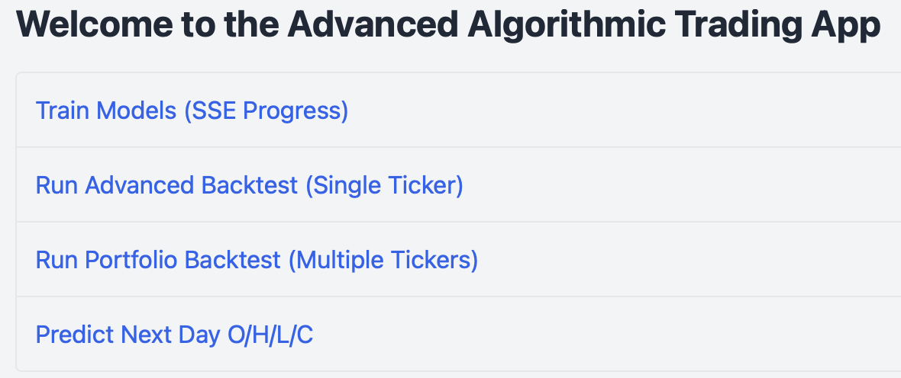
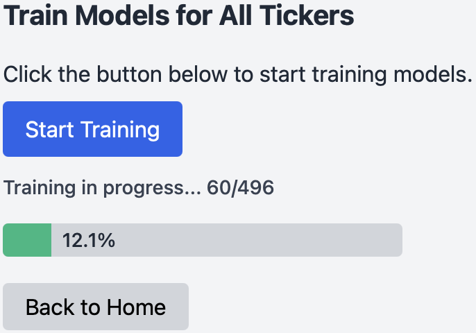
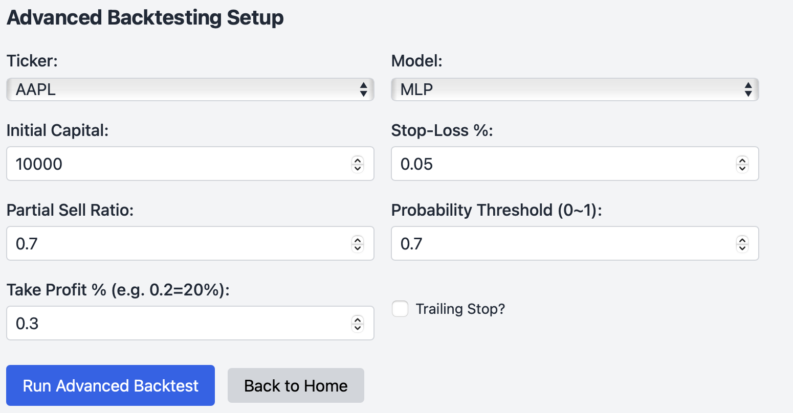
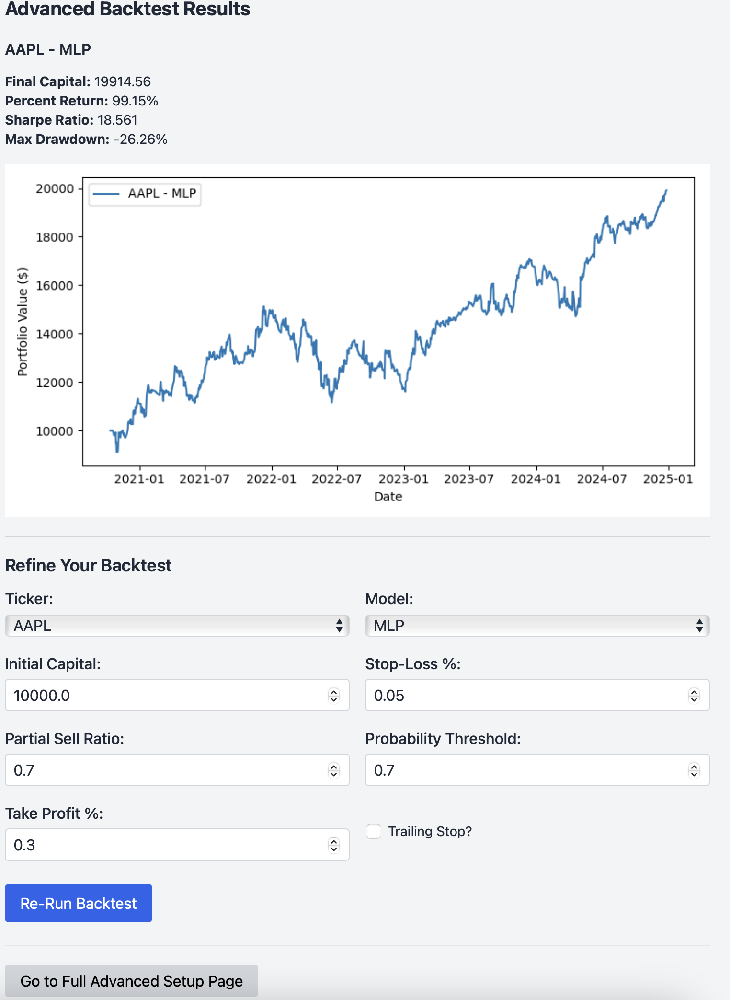
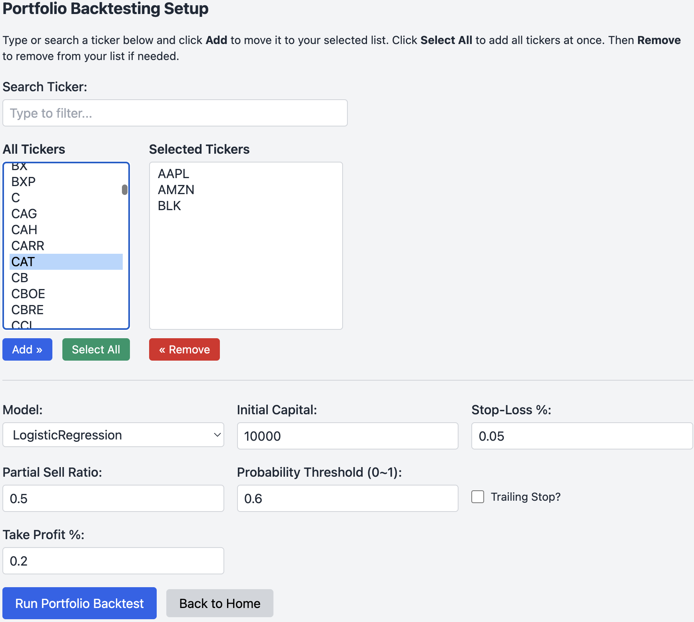
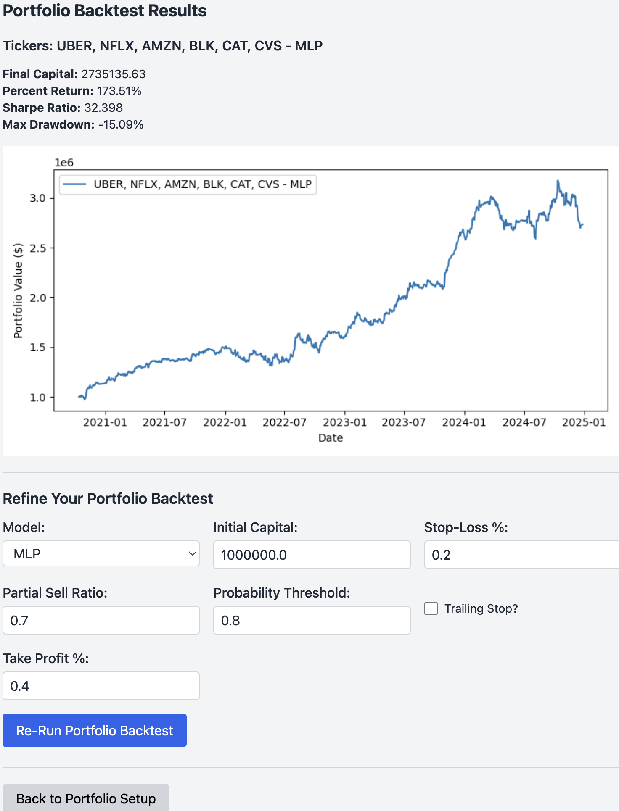

# Advanced Algorithmic Trading App

Welcome to the **Advanced Algorithmic Trading App**, a Flask-based web application for **training, backtesting, and deploying** multiple machine learning models (classification and regression) on historical stock market data. This project is designed to let you:

1. **Train** models on historical data (e.g., S&P 500) to classify buy/sell/hold signals and predict next-day O/H/L/C.
2. **Run advanced backtests** (single ticker or portfolio) to evaluate performance (including trades, Sharpe, max drawdown, etc.).
3. **Predict** next-day O/H/L/C using an ensemble approach (RandomForest + MLP).

Below you’ll find:

- [Project Features](#project-features)  
- [Folder Structure](#folder-structure)  
- [Data Acquisition](#data-acquisition)  
- [How to Use](#how-to-use)  
- [Key Parameters & Tuning](#key-parameters--tuning)  
- [Screenshots](#screenshots)  
- [Acknowledgments](#acknowledgments)  

---

## Project Features

1. **Model Training with SSE Progress**  
   - A dedicated page (`/train`) to launch training on all tickers in the `hist/` folder.  
   - Real-time progress updates via **Server-Sent Events** (SSE) so you can track the training status.

2. **Advanced Single-Ticker Backtest**  
   - Allows you to select one ticker, choose a model, and tweak parameters (e.g., stop-loss, partial sell, probability threshold).  
   - Displays performance metrics (percent return, Sharpe ratio, max drawdown, # trades, win rate, etc.) along with a visual equity curve.

3. **Portfolio Backtest**  
   - Enables multiple ticker selection for a naive portfolio approach that splits capital equally.  
   - Aggregates trades, merges stats, and plots the portfolio’s combined equity curve.

4. **Next-Day Prediction**  
   - Given a trained model, this feature predicts tomorrow’s O/H/L/C using an **ensemble** of RandomForestRegressor + MLPRegressor.  
   - Displays buy/hold/sell suggestions based on a 2% threshold move.

5. **TailwindCSS**-Styled UI  
   - Clean, responsive web interfaces for training, backtesting setup, portfolio selection, and prediction results.

---

## Folder Structure

```
.
├── app.py                   # Main Flask application
├── download-nasdaq-historical-data.ipynb  # (Mentioned in Data Acquisition)
├── hist/                    # Folder containing CSV files of historical data
├── models.pkl               # Serialized models & scalers after training
├── ...
└── README.md                # This readme
```

### `hist/` Folder

- Contains 5 years of daily history for current S&P 500 companies (as of 12/27/2024).  
- Each CSV is named `<TICKER>.csv`.

> **Note**: By default, this repo includes data **up to 12/27/2024** for the S&P 500 companies as of that date. If you need more up-to-date data, you can download it via the instructions/notebooks mentioned below.

---

## Data Acquisition

- **S&P 500 Constituents**:  
  The S&P 500 list is pulled from the [datasets/s-and-p-500-companies GitHub repo](https://github.com/datasets/s-and-p-500-companies/blob/main/data/constituents.csv).  
- **Historical Data**:  
  We provide the [notebook](https://www.kaggle.com/code/jacksoncrow/download-nasdaq-historical-data/notebook) `download-nasdaq-historical-data.ipynb`, which demonstrates how to fetch daily price history for selected symbols.  
- **Included Data**:  
  By default, the repo ships with 5 years of daily history (up to 12/27/2024) for the S&P 500 companies. However, it may not be fully up-to-date.  
- **Updating Data**:  
  If you want fresh data, run the `download-nasdaq-historical-data.ipynb` with updated date ranges, or use another data provider. Place those CSVs in `hist/` so the Flask app can detect and train on them.

---

## How to Use

1. **Install Dependencies**  
   - Create a virtual environment (recommended):  
     ```bash
     python3 -m venv venv
     source venv/bin/activate
     pip install -r requirements.txt
     ```
2. **Run the Flask App**  
   ```bash
   python app.py
   ```
   - The application runs by default on `http://127.0.0.1:5000/`.

3. **Navigate the App**  
   - `http://127.0.0.1:5000/` => Main index page with links to:
     - **Train Models (SSE Progress)**  
     - **Run Advanced Backtest (Single Ticker)**  
     - **Run Portfolio Backtest (Multiple Tickers)**  
     - **Predict Next Day O/H/L/C**  

4. **Train the Models**  
   - Go to `/train`, click **Start Training**.  
   - A progress bar will update in real-time as each ticker is trained.  
   - Once finished, `models.pkl` is created/updated with all trained models.

5. **Perform a Backtest**  
   - Single Ticker:  
     - `/select_backtest_advanced` => pick a ticker, model, and parameters => run backtest => get equity curve, stats.  
   - Portfolio:  
     - `/select_backtest_portfolio` => multiple tickers selection => run combined backtest => see aggregated stats.

6. **Predict Next Day**  
   - `/predict_next_day` => pick a ticker => it loads the relevant model => outputs next-day predicted open, high, low, close, plus a suggested action (buy/sell/hold).

---

## Key Parameters & Tuning

You’ll find multiple **hyperparameters** and **thresholds** that can heavily influence performance:

1. **Classification Thresholds**:
   - **`prob_threshold`** (default 0.6):  
     - Minimum probability for a BUY or SELL to be considered.  
     - Increase it to trade less frequently but (potentially) more accurately; decrease for more trades.

2. **Stop-Loss Settings**:
   - **`stop_loss_percent`** (default 0.05 => 5%):  
     - The trailing stop triggers a sell if price drops this % from the highest price since entry.  
     - Lower means tighter stops, higher means looser stops.

3. **Take-Profit Settings**:
   - **`take_profit_percent`** (default 0.2 => 20%):  
     - Triggers partial sell if price rises above entry by this %.

4. **Partial Sell Ratio**:
   - **`partial_sell_ratio`** (default 0.5):  
     - Proportion of shares sold upon take-profit or when a SELL signal fires.  
     - Increase to exit trades more aggressively.

5. **Trailing Stop**:
   - **`trailing_stop`** (default True):  
     - Enables a dynamic stop-loss that moves up with new highs.  
     - Disabling it sets a fixed stop-loss from entry.

6. **Ensemble Methods**:
   - Next-Day Predictions for O/H/L/C use an ensemble of **RandomForestRegressor** & **MLPRegressor**.  
   - You can tweak:
     - **# estimators** (e.g., `n_estimators=100`) for RandomForest.  
     - **hidden_layer_sizes**, **max_iter** for MLPRegressor.  
   - These changes can improve/regress the predictive accuracy.

7. **Data Threshold** (`create_labels`):
   - **`threshold=0.0025`** => +/- 0.25% used to label buy vs sell vs hold.  
   - Increase it for less frequent buy/sell signals, decrease it for more frequent signals.

8. **SSE Sleep**:
   - The code uses `time.sleep(0.5)` in `train_all_tickers_with_progress` purely for visualizing progress.  
   - Adjust if you want to speed up or slow down training updates.

Each parameter interacts with the algorithm’s risk profile, trade frequency, and overall profitability. Experiment to find a combination that suits your strategy objectives.

---

## Screenshots

Below are some placeholders where you can insert screenshots of your application in action. Replace these references with actual image paths or embed from your repo:

1. **Main Index Page**  
   

2. **Training Page**  
   

3. **Single Ticker Backtest Setup**  
   

4. **Single Ticker Backtest Results**  
   

5. **Portfolio Backtest Setup**  
   

6. **Portfolio Backtest Results**  
   

7. **Predict Next Day Page**  
   

---

## Acknowledgments

- **S&P 500 Constituents** from the [datasets/s-and-p-500-companies GitHub repo](https://github.com/datasets/s-and-p-500-companies/blob/main/data/constituents.csv).  
- **Data Download Notebook**: [Kaggle Notebook by Jackson Crow](https://www.kaggle.com/code/jacksoncrow/download-nasdaq-historical-data/notebook).  
- **TailwindCSS** for front-end styling.  
- **scikit-learn** for ML models and utility.  
- **Flask** for the web application framework.  
- **Matplotlib** + **Pandas** for data processing and plotting.  
